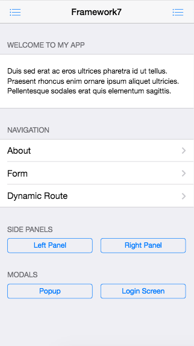
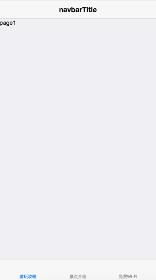
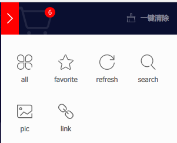
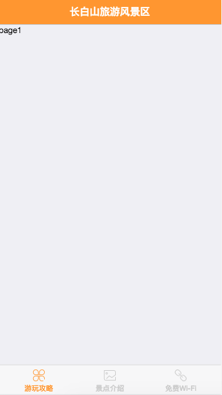

# 基本框架

尽管码农干的是搬砖的活，但是开始之前我们还是要读读文档，寻找一些线索让我们的工作更容易，
多思考少敲代码，规划好了工作舒心日后维护也方便。

这个项目首先做H5的部分，毕竟App只是个噱头和装B工具而已，在一定的发展阶段没什么鸟用。
通过文档我们看到可以从模板创建项目，这里选用`Framework7 Vue Webpack App Template`：

```
git clone https://github.com/nolimits4web/Framework7-Vue-Webpack-Template cbsapp
cd cbsapp
npm install
npm run dev
```

访问[http://localhost:8080/](http://localhost:8080/)就可以看到效果了，开始是个看起来又丑又挫的页面，
有几个基本的组建可以显示左右面板和popup弹出层神马的。



我们要将它变成我们想要的结构：顶部标题，底部三个按钮，中间主区域随按钮选择而变化。

编辑src/app.vue 可以看到当前布局的代码，我们重写这一部分:

```html
<template>
  <!-- App -->
  <div id="app">
    <!-- Statusbar -->
    <f7-statusbar></f7-statusbar>
    <!-- Main Views -->
    <f7-views>
      <f7-view id="main-view" navbar-through :dynamic-navbar="true" main>
        <f7-navbar theme="white">
          <f7-nav-left>
          </f7-nav-left>
          <f7-nav-center sliding>navbarTitle</f7-nav-center>
          <f7-nav-right>
          </f7-nav-right>
        </f7-navbar>
        <f7-pages>
          <f7-page toolbar-fixed navbar-fixed>
            <f7-toolbar tabbar labels>
              <f7-link icon="iconfont icon-ios7homeoutline" text="游玩攻略" tab-link="#tab1" active></f7-link>
              <f7-link icon="iconfont icon-ios7heartoutline" text="景点介绍" tab-link="#tab2"></f7-link>
              <f7-link icon="iconfont icon-ios7chatbubbleoutline" text="免费Wi-Fi" tab-link="#tab3"></f7-link>
            </f7-toolbar>
            <f7-tabs>
              <f7-tab id="tab1" active>
                page1
              </f7-tab>
              <f7-tab id="tab2">
                page2
              </f7-tab>
              <f7-tab id="tab3">
                page3
              </f7-tab>
            </f7-tabs>
          </f7-page>
        </f7-pages>
      </f7-view>
    </f7-views>
  </div>
</template>

<script>
export default {}
</script>
```

效果如下，点击底部按钮可替换不同的tab内容



界面看起来依然又丑又挫，我们先美化它一下，先去阿里巴巴图标库弄几个图标

[传送门：阿里巴巴图标库](http://www.iconfont.cn/)

选了6个图标下载代码



解压缩字体，将目录改名为icons后复制到项目src目录下

修改main.js加载css
```
import icons from './icons/iconfont.css'
```
修改app.vue应用样式
```
<f7-toolbar tabbar labels>
  <f7-link icon="iconfont icon iconfont icon-all" text="游玩攻略" tab-link="#tab1" active></f7-link>
  <f7-link icon="iconfont icon iconfont icon-pic" text="景点介绍" tab-link="#tab2"></f7-link>
  <f7-link icon="iconfont icon iconfont icon-link" text="免费Wi-Fi" tab-link="#tab3"></f7-link>
</f7-toolbar>
```

给标题增加个背景色，改改按钮文字大小和图标样式

修改app.vue增加style

```html
<style lang="css">
.navbar{
  background-color: #ff9630;
}
.navbar-inner .center{
  color: #fff;
  font-weight: 500 !important;
}
.toolbar-inner a{
  color:#ccc;
}
.toolbar-inner a.active{
  color:#ff9630;
}
.tabbar-labels span.tabbar-label{
  font-size:12px;
}
.iconfont{
  font-size:20px;
}
</style>
```


