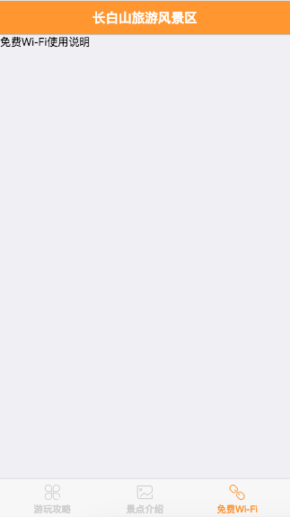

# 添加单页组件

先从简单的做起，接下来我们做`免费Wi-Fi`页面，这个页面其实就是个Wi-Fi接入的教程。
因为用户要用微信认证，这一行为是发生在用户接入Wi-Fi时，并不需要App自动连Wi-Fi，
我们的工作就简单了，写个单页的图文教程就好。

首先在项目src目录下创建一个目录components来存放自定义的组件。

新建wifi.vue文件

```html
<template>
    <div>
        免费Wi-Fi使用说明
    </div>
</template>
```

在app.vue中导入组件

```html
<script>
import WifiView from './components/wifi.vue'
export default {
  components: {
    WifiView,
  }
}
</script>
```

修改app.vue中的tab3内容为wifi.vue组件

```html
<f7-tab id="tab3">
	<wifi-view></wifi-view>
</f7-tab>
```

页面效果如下


