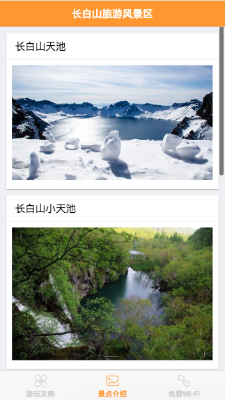

# 图片列表页面

接下来做景点介绍部分，首先是显示所有景点列表页面，
每个作为一个card，配上标题和图片，然后点击图片后进入景点语音介绍的播放页面。
这部分使用f7的card组件来做，card header显示景点名称，card
content显示景点的配图，点击图片进入对应的景点语音介绍的播放页面。

```html
<template>
    <div class="content">
        <div class="card" v-for="item in jingdian" :key="item.slug">
            <div class="card-header">{{ item.title }}</div>
            <div class="card-content">
                <a :href="'/jieshuo/'+item.slug">
                    
                </a>
            </div>
        </div>
    </div>
</template>

<script>
import img_tianchi from './tianchi.jpg'
import img_xiaotianchi from './xiaotianchi.jpg'
import img_dapubu from './dapubu.jpeg'
import img_lvyuantan from './lvyuantan.jpg'
import img_dixiasenlin from './dixiasenlin.jpeg'
export default {
  data() {
    return {
        jingdian: [
            {
                slug: 'tianchi',
                title: '长白山天池',
                image: img_tianchi
            },
            {
                slug: 'xiaotianchi',
                title: '长白山小天池',
                image: img_xiaotianchi
            },
            {
                slug: 'dapubu',
                title: '长白山大瀑布',
                image: img_dapubu
            },
            {
                slug: 'lvyuantan',
                title: '长白山绿渊潭',
                image: img_lvyuantan
            },
            {
                slug: 'dixiasenlin',
                title: '长白山地下森林',
                image: img_dixiasenlin
            },
        ]
    }
  }
}
</script>

<style lang="css">
    .card-content{
        padding: 10px;
    }
</style>
```

最终效果如下图


