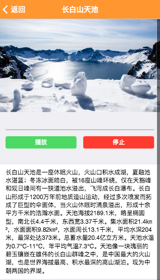

# 景点语音介绍页面

在景点列表页面点击相应的景点将进入景点语音介绍页面，
并自动播放景点介绍的语音内容，这个页面布局类似音乐播放器，
顶部显示景点照片，中部区域显示景区介绍mp3文件的播放进度及播放暂停等功能按钮。

首先找个播放mp3的vue组件 vue-howler

```npm install vue-howler```

在`src/components`目录下新建`audio-player.vue`文件

```html
<script>
  import VueHowler from 'vue-howler'

  export default {
    mixins: [VueHowler]
  }
</script>

<template>
  <div>
    <span>Total duration: {{ duration }} seconds</span>
    <span>Progress: {{ (progress * 100) }}%</span>
    <button @click="togglePlayback">{{ playing ? 'Pause' : 'Play' }}</button>
    <button @click="stop">Stop</button>
  </div>
</template>
```

修改webpack的打包配置增加对mp3等文件的打包支持

```javascript
{
	test: /\.(mp3|mp4|webcam|wav)(\?.*)?$/,
	loader: 'url-loader',
	query: {
	  limit: 10000,
	  name: utils.assetsPath('medias/[name].[hash:7].[ext]')
	}
},
```

复制了项目模板中`dynamic-route.vue`的内容,
这里边有router传递参数和动态导航条的例子可供参考，
这里修改布局，顶部增加图片，中部为播放器，底部为文字内容

```html
<template>
  <f7-page>
    <f7-navbar title="Dynamic Route" back-link="Back" sliding></f7-navbar>
    

    <audio-player :sources="audioSources" :loop="true" :autoplay="true"></audio-player>

    <f7-block inner>
      <ul>
        <li><b>Url:</b> {{$route.url}}</li>
        <li><b>Path:</b> {{$route.path}}</li>
        <li><b>Hash:</b> {{$route.hash}}</li>
        <li><b>Params:</b>
          <ul>
            <li v-for="(value, key) in $route.params"><b>{{key}}:</b> {{value}}</li>
          </ul>
        </li>
        <li><b>Query:</b>
          <ul>
            <li v-for="(value, key) in $route.query"><b>{{key}}:</b> {{value}}</li>
          </ul>
        </li>
        <li><b>Route:</b> {{$route.route.path}}</li>
      </ul>
    </f7-block>
    <f7-block inner>
      <f7-link @click="$route.view.router.back()">Go back via Router API</f7-link>
    </f7-block>

  </f7-page>
</template>
```

在介绍页面中引入播放器组件和音频文件

```html
<script>
  import AudioPlayer from '../audio-player.vue'
  import mp3_tianchi from './tianchi.mp3'

  export default {
    components: {
        AudioPlayer
    },
    data () {
      return {
        audioSources: [
          mp3_tianchi
        ]
      }
    }
  }
</script>
```

最终效果如下图


